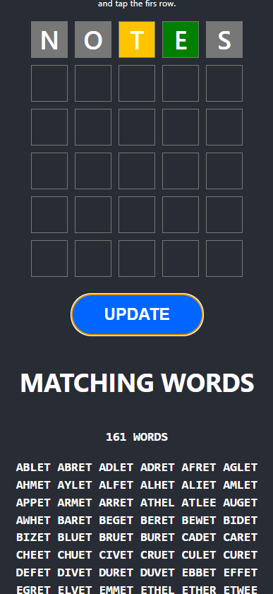
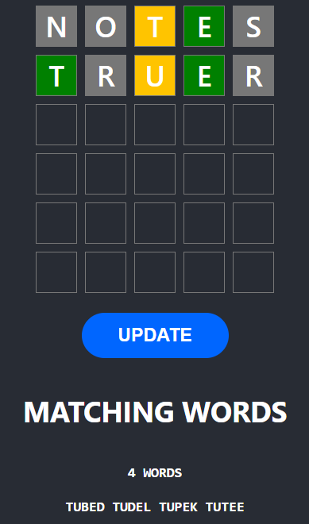

# Wordle Solver

Just a small utility to help solving Wordle puzzles. Just enter the words and colors you use in the Wordle app and this utility will print the words that match. 

[Access the live version here](https://dsuarezv.github.io/wordle-solver-js)

## Usage

# Building

    git clone https://github.com/dsuarezv/wordle-solver-js
    npm install
    npm start
