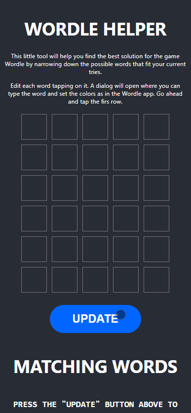
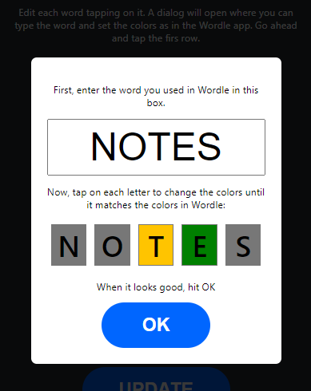

#[Wordle Solver](https://dsuarezv.github.io/wordle-solver-js)

Just a small utility to help solving Wordle puzzles. 

## Usage

[Click here to access the app](https://dsuarezv.github.io/wordle-solver-js)

**You can't play the game there, but you can get the list of words that fit in your Wordle game to improve your winning odds.**

So, to use this solver, you would enter a word in the Wordle app and the replicate the result (the colors) here. 

Enter the words and colors you use in the Wordle app and this utility will print the words that match. Edit each word tapping on it. A dialog will open where you can type the word and set the colors as in the Wordle app. Here is a summary video: 

### The "edit word" dialog

In the edit word dialog, first type the word in the text box using your keyboard. The letters you type will appear in the five boxes below. When you have entered the five letters of the word, you can tap on each of the letter boxes below to set the colors. 

Tap each letter several times until the color here matches the color in Wordle. When you have, hit "OK", or tap outside the dialog to cancel and go back. 

## How it works

The app runs entirely in your browser. It contains a list of words and an algorithm to filter it according to the rules specified in the letters and colors you enter. It also considers the letter locations when filtering, so if a yellow letter is in position 4, words with that letter in position 4 will be discarded. You can find the solver code in the file [Solver.js](blob/main/src/Solver.js). 

### Duplicated letters

A green letter may appear more than once, so words that contain such letters in other locations are displayed.

When a yellow letter is duplicated, Wordle will display the second one in grey color (like it's in a different location and rejected at the same time). This is aspecial case that is handled internally by the solver. 

## Building

    git clone https://github.com/dsuarezv/wordle-solver-js
    npm install
    npm start

## To do

* ~~fix spaces in word input textbox.~~
* add explicit close button to input window.
* add option to remove word in the grid.
* ~~add google analytics.~~
* ~~add help button with dialog that displays the tutorials above.~~
* ~~add other languages, just need the wordlists, adding some flag icons and maybe translating the UI (maybe not needed in the beginning).~~
* ~~the case of the same char marked yellow and grey in a different location that filters too much.~~
* letter frequency stats.
* ~~improve English wordlist. Should include dictionary words only.~~
* score each word based on current wordlist char frequency and non-repeating chars. Normalize each criteria and average (weighted?) or multiply to get final word score. 